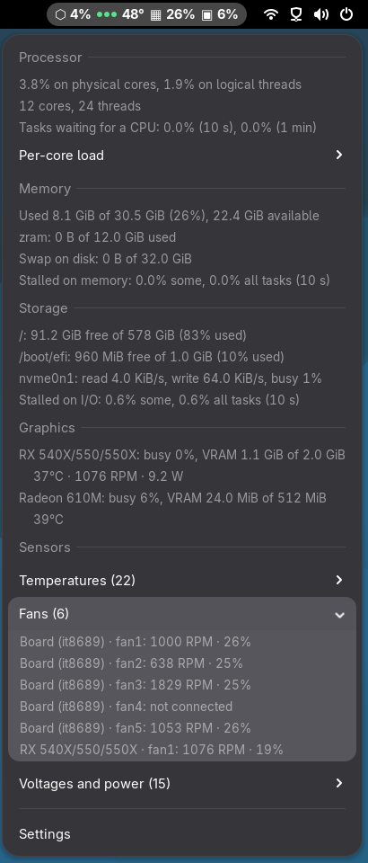
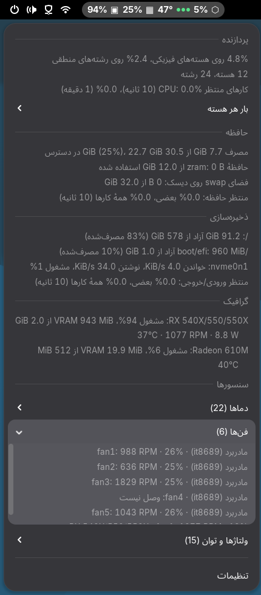
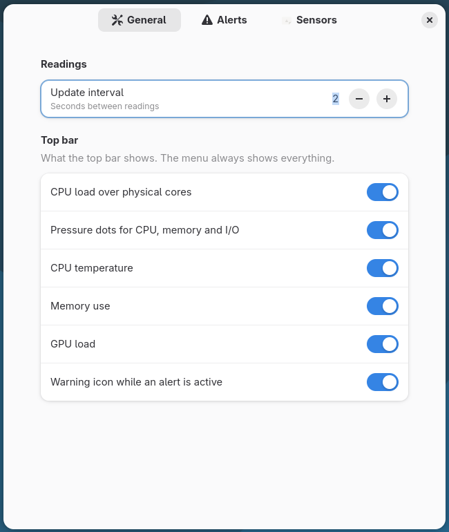

# Core Sentinel

Honest system load and hardware health for the GNOME Shell top bar.


Most monitors answer *"how busy is the machine?"* with an average over logical
CPUs and a "used memory" figure that counts page cache. Core Sentinel answers
two better questions:

- **What is actually limiting my machine right now?** CPU load over *physical*
  cores, and kernel pressure (PSI) for CPU, memory and I/O.
- **Is the hardware healthy?** Every hwmon sensor, with alerts for stalled or
  stopped fans, hot components, nearly full disks, memory spilling to disk and
  thrashing.

| Menu | Persian (RTL) | Preferences |
|---|---|---|
|  |  |  |

## Features

- **Physical-core CPU load.** SMT sibling threads are merged using the kernel's
  topology, so twelve busy cores on a 24-thread CPU read 100%, not 50%. The
  logical average and a per-core breakdown are in the menu.
- **Pressure (PSI)** for CPU, memory and I/O, shown as three dots in the top bar
  and as numbers in the menu.
- **Memory** used without reclaimable page cache; zram (with its compression
  ratio) and swap on disk shown apart.
- **Storage**: free space per filesystem, read/write throughput and busy time
  per disk.
- **GPU** (AMD, via `amdgpu`): load, VRAM, temperature, fan and board power. A
  GPU in runtime suspend is never read, so a laptop dGPU is not woken up.
- **Sensors**: every temperature, fan (with PWM duty), voltage and power
  channel the kernel exposes, grouped by device.
- **Alerts** as desktop notifications, with grace periods and hysteresis so a
  reading hovering at a limit raises one alert, not a stream:
  - a fan driven above a PWM threshold that reports 0 RPM (stalled), or a fan
    that was spinning and stopped;
  - a fan slower than a minimum you set;
  - a sensor at its temperature limit (the hardware's own limit by default);
  - a filesystem almost full; memory spilling into swap on disk; thrashing;
  - optionally, CPU saturation and I/O bottlenecks.
- **Unconnected fan headers are recognised.** A fan never seen spinning is shown
  as *not connected* and raises no alerts. Once seen spinning it is remembered,
  so a fan that dies before you log in is still caught.
- **Per-sensor settings**: rename, hide, set a minimum RPM or a temperature limit,
  mark a fan as zero-RPM.
- Translations: English, Persian.

## Requirements

- GNOME Shell 48, 49 or 50.
- Sensor drivers loaded for your hardware. Run `sensors` (from `lm-sensors`):
  whatever it lists, Core Sentinel shows. Many desktop boards need a Super I/O
  driver for fans and voltages, for example `it87` on Gigabyte boards
  (`modprobe it87 ignore_resource_conflict=1`) or `nct6775` on ASUS and MSI.

## Install

From extensions.gnome.org (coming soon), or from source:

```sh
git clone https://github.com/mehdashti/core-sentinel.git
cd core-sentinel
make install
```

Then log out and back in (Wayland) and enable *Core Sentinel* in the Extensions app.

## How it measures

| Figure | Source | Notes |
|---|---|---|
| Physical-core load | `/proc/stat`, `/sys/devices/system/cpu/cpu*/topology` | A core's load is `min(100, sum of its threads)`. Linux places tasks on idle physical cores before doubling up on siblings, so overlap is rare until every core is busy anyway. |
| Pressure | `/proc/pressure/{cpu,memory,io}` | *some*: at least one task stalled; *full*: all non-idle tasks stalled. Dots: green below 5%, yellow below 25%, red above (10 s average of *some*). |
| Memory used | `/proc/meminfo` | `MemTotal − MemAvailable`, the kernel's own estimate of what can be handed out without swapping. |
| zram / swap | `/proc/swaps`, `/sys/block/zram*/mm_stat` | Swap on disk is where slowdowns begin; zram is compressed RAM. |
| Disk I/O | `/proc/diskstats` | Whole disks only; busy is the share of time with I/O in flight. |
| Sensors | `/sys/class/hwmon` | Keyed by driver and device (`it8689@it87.2624/fan1`), not by `hwmonN`, which can change between boots. |
| Temperature limits | `tempN_crit`, then `tempN_max` | Implausible values (0, 127, 255 °C) are ignored. A heat alert ends 5 °C below the limit. |
| Fan stall | `fanN_input`, `pwmN` | 0 RPM while the duty cycle is at or above the stall threshold (20% by default) for the grace period (10 s). |

Everything is read asynchronously from `/proc` and `/sys` every two seconds (configurable).
Core Sentinel uses no network and starts no helper processes.

## Development

```sh
make test         # unit tests (gjs)
make lint         # ESLint
make snapshot     # print what the data layer sees on this machine
tools/shell-test.sh OUT_DIR [LOCALE]
                  # run the extension in an isolated headless GNOME Shell and
                  # screenshot the panel, menu, submenus and preferences
make install-dev  # symlink the working tree as the installed extension
make pot          # refresh po/core-sentinel.pot and merge into the .po files
make pack         # build dist/core-sentinel@mehdashti.github.io.shell-extension.zip
```

`src/lib/` holds everything that does not need GNOME Shell: data readers, the
alert rules, labels and formatting. It is shared by the shell (`extension.js`),
the preferences window (`prefs.js`) and the tests. `src/ui/` is shell-only.

### Translations

Copy `po/core-sentinel.pot` to `po/<language>.po`, translate, and open a pull
request. Keep the `%s` and `%d` placeholders in their original order.

## License

GPL-2.0-or-later. See [LICENSE](LICENSE).
